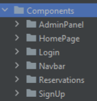
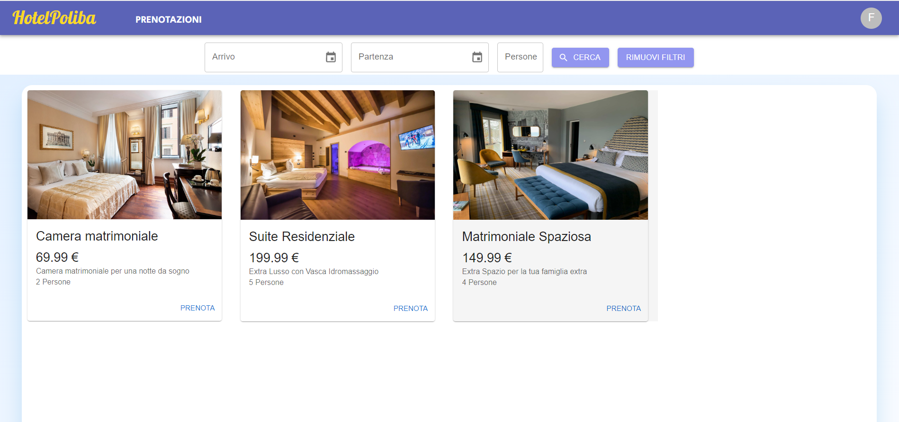
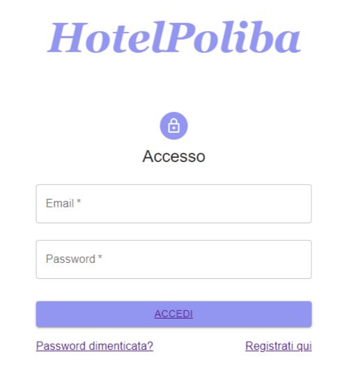
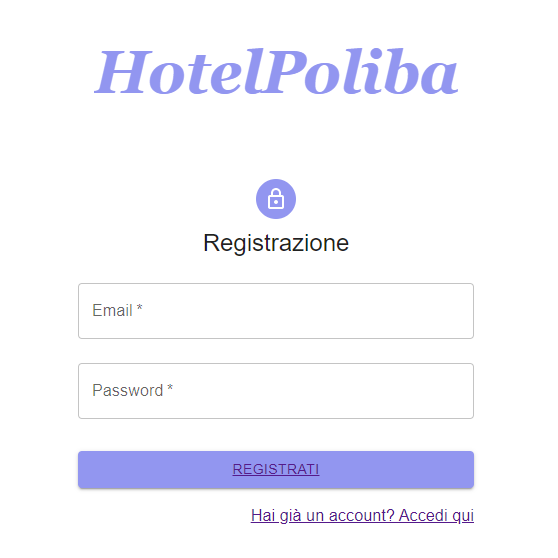
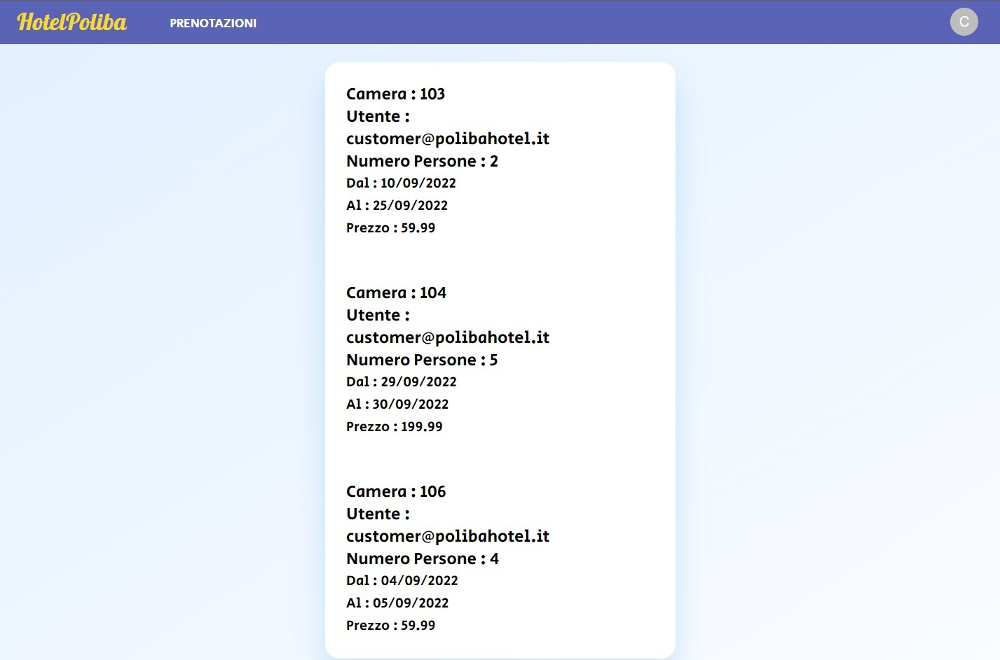
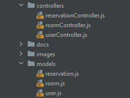
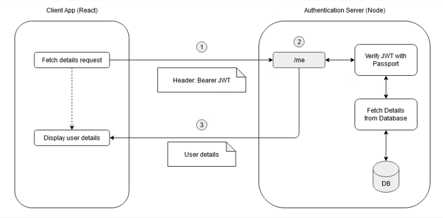

# HotelPoliba

Si vuole realizzare un’applicazione web per la gestione, prenotazione e la recensione delle stanze di un albergo.

Tutti i casi d'uso sono stati implementati e in particolare:
- Il frontend è stato realizzato in React
- Sono state gestite le sessioni attraverso passport secondo i JWT.
- Nonostante sia stata utilizzata MUI come libreria grafica, gran parte del CSS è stato realizzato a mano.

# Autenticazione

Nell'applicazione si può:
- Creare un nuovo utente (che verrà registrato come "utente")
- Accedere attraverso un utente già registrato
- Come utente si può ricercare un stanza libera in base a data di arrivo, partenza e numero di persona, prenotarla e
    visualizzare la propria prenotazione
- Se si vuole accedere come "admin" per poter visualizzare le prenotazione, aggiungere o rimuovere stanze, anche con 
relative foto.
=> email: admin@polibahotel.it , password: test
- Nuovi utenti di tipo "admin" potranno essere aggiunti dal backend tramite le API successivamente specificate.

## Frontend

Per il frontend è stato utilizzato React.
All'interno dell'applicazione web è presente una cartella con delle directories, che
racchiudono tutti i componenti visivi della stessa.

### HomePage

La pagina principale permette di prenotare una camera.

### Login

Questo componente permette di effettuare il login se si è
già registrati per poter visuallizare le mie prenotazioni.

### SignUp

Questo componente permette di effettuare la registrazione.

### Navbar

La Navbar è il container per i vari bottoni per avere accesso alla lista delle prenotazioni e 
per effettuare il logout.

### Reservations

Reservations consente di visualizzare le proprie prenotazioni.

## Backend

Il backend dell’applicazione è stato realizzato mediante Node.js ed Express.js.
I dati sono stati memorizzati all’interno di un database MongoDB.

### Models

Nella directory del backend, models, vengono creati gli oggetti con i propri
attributi che saranno aggiunti e gestiti dal database.

### Controllers

In questa directory è presente la logica per effettura  il logout, il login con
l'autentificazione tramite jwt, l'aggiunta, l'eliminazione o l'aggiornamento
di una stanza e per controllare e gestire le prenotazioni.

### Autenticazione con JWT

Poiché JWT non deve essere verificato rispetto al database, migliora le prestazioni evitando la chiamata al database
in ogni richiesta.
Inoltre è archiviato sul lato client, aiuta a prevenire gli attacchi XSRF/CSRF.

Le funzione utilizzate per l'autenticazione all'interno di userController sono:
1. getToken, viene utilizzato per creare il JWT.
2. getRefreshToken, viene utilizzato per creare il token di aggiornamento, che a sua volta è un JWT.
3. verifyUser è un middleware che deve essere chiamato per ogni richiesta autenticata.
4. COOKIE_OPTIONS viene utilizzato per creare il cookie del token di aggiornamento, che dovrebbe essere 
solo http e sicuro in modo che non possa essere letto dal javascript del client. SameSite è impostato su "Nessuno" 
poiché client e server saranno in domini diversi.

## API

L’applicazione dovrà fornire ai diversi attori le corrette API per il loro successivo utilizzo mediante dispositivi
differenti. In particolare, i clienti dell'hotel potranno accedere al menù mediante il sito web e prenotare una stanza
mediante l'immisione di data di partenza, arrivo e numero di persone. I clienti, inoltre, potranno visualizzare le loro
prenotazioni. L’amministratore dell'hotel potrà visualizzare la lista delle prenotazione effettuate dai clienti,
aggiungere o rimuovere le camere, con inserimento e aggiornamento di foto.  

